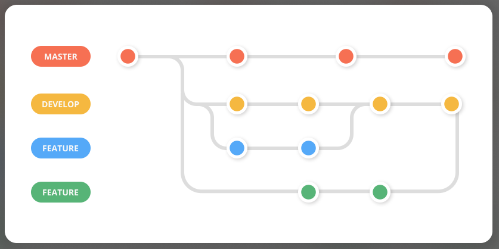

# Git - comandos

`git add .` Este comando agrega todos los archivos al stage, y quedan listos para ser comiteados

`git add <path/file.ext>`  agrega solamente el archivo file al stage, y lo deja listo para comitearlo.

`git commit -m "mensaje"`  genera un commit con los archivos que estaban preparados (Stage)

`git push origin <rama>`  envia todos los commits realizados al repositorio remoto (github)

`git status` muestra el estado del stage

`git remote -v` muestra el repositorio remoto al cual estoy conectado

`git branch` muestra las ramas disponibles

`git checkout <rama>` cambia de rama

`git checkout -b <rama>` crea una rama y se cambia a ella

`git branch -d <rama>` borra la rama (si se puede)

`git branch -D <rama>` borra si o sí la rama

# Collaborative Project

**0. En GitHub**

- Creo el repo (desde cero o desde algún template)
- Me encuentro en la rama 'main' y abro un Codespace

**1. En Codespace**

- Creo la rama 'develop' desde main o master
- Me voy a la rama 'develop'
- Creo la rama de la 'feature' desde develop e ingreso en ella
- Realizo mi desarroll
- git add
- git commit -m "feat: ......................."
- git push origin feat-rama

**2. En GitHub**
- Pull Request desde 'feat-rama' a 'develop' con Review
- Otro colaborador, hace review -> aprueba
- Merge de la rama a develop
- Borrra la rama en GitHub

**3. En Codespace**
- borrar la 'rama-feat'
- git pull origin develop (actualizo mi develop con lo que contiene el remoto)
- nueva feature, creo otra rama
